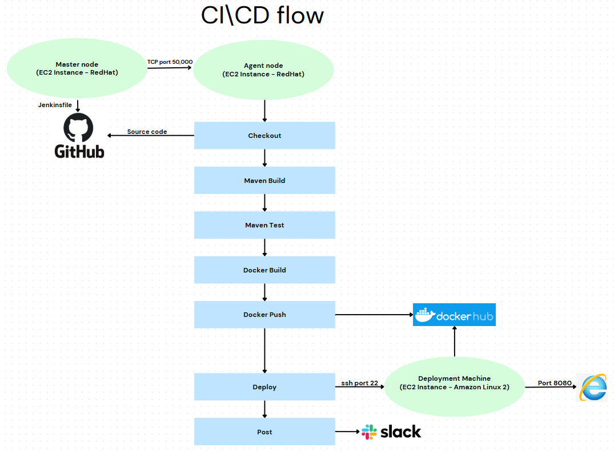

# choose-a-song

This Spring Boot-based Java web application allows users to select a favorite song from a predefined list of three and display its lyrics. The application is accessible via a web browser.

## **Steps to set up the application and run it:**  

### **1. Through a CI\CD Jenkins pipeline:**

#### **A visual overview of the CI\CD flow**

#### **Create the source code**  
1. Structure the code to support compilation and testing using Maven.
2. Create a GitHub repository and upload the source code.
3. Run the application locally on port 8080 and verify that it opens successfully in a web browser.

#### **Create the pipeline**
1. Install Java and Docker on an EC2 instance, then deploy a Jenkins image on it. Configure this instance as the master node.
2. Install Java and Docker on a separate EC2 instance and designate it as the agent node.
3. Create a Pipeline job in jenkins
4. Write a Jenkinsfile to define the steps for the CI/CD pipeline.
5. Install the default plugins and add: GitHub plugin, Maven Integration and Slack Notification Plugin.

#### **Checkout the Code, Package, and Test the Code Using Maven**
1. Ensure that Maven and Git are installed on the agent node and the necessary environment paths are configured.
2. Checkout the source code and configure the job to trigger automatically whenever a commit is pushed to the main branch (via a GitHub webhook).
3. Build the JAR file and run tests using Maven. The test validates the HTTP connection to the application.

#### **Build a docker image, test it, and push to DockerHub**
1. Create a Dockerfile to build a lightweight image that exposes the application on port 8080.
2. Build the Docker image and test its functionality to ensure it runs and stops as expected.
3. Push the image to DockerHub using the appropriate credentials.

#### **Deploy the application via another EC2 instance**
1. SSH into the EC2 instance.
2. Pull the latest Docker image from DockerHub.
3. Run the Docker container, ensuring port 8080 is exposed.
4. Upon the pipeline's completion (successful or failed), send a notification to the appropriate Slack channel.

#### **At this point the application is up and running**

### **2. Through Terraform provisioning:**

#### **We use the image that is stored in DockerHub** 

#### **Create a new instance and run the app in it, using a new EC2 instance**  
1. Install Terraform and AWS CLI on the instance.
2. Ensure the instance has proper access to the AWS environment by configuring the AWS CLI (aws configure).
3. Set up the necessary Terraform configuration files to provision the EC2 instance with all required settings.
4. Run Terraform with the plan and apply commands to provision the instance and ensure it is created successfully and running the application.

### **Thank you for reading**

